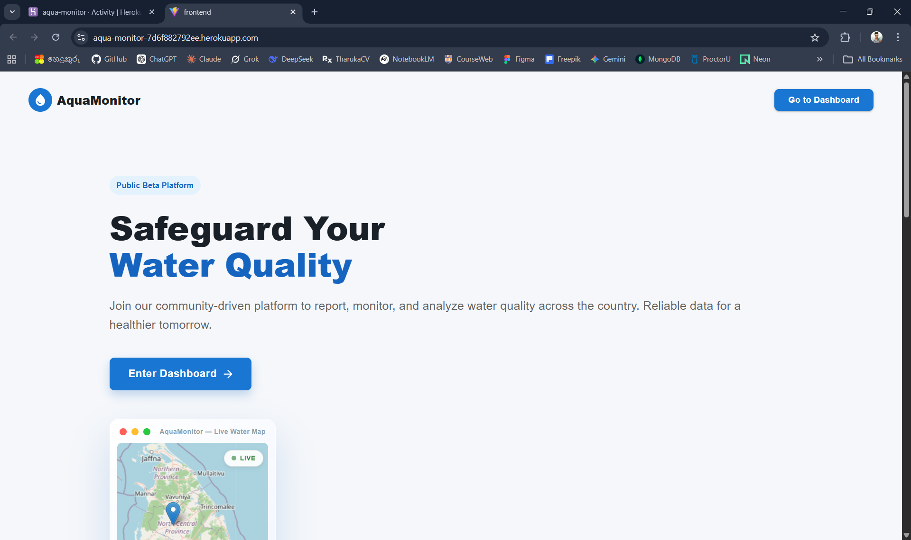
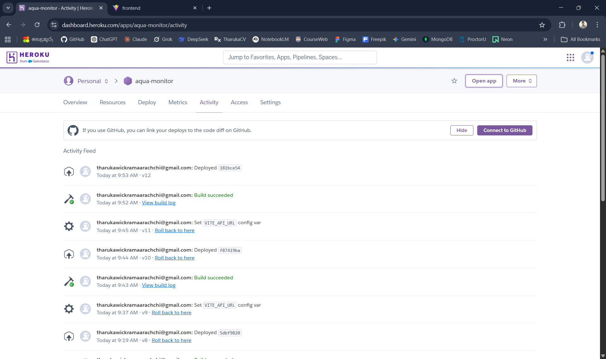

# 🌊 Water Quality Report API

A RESTful API backend for a **crowdsourced water quality report system** built with Node.js, Express.js, and MongoDB.

[](https://nodejs.org/)
[](https://expressjs.com/)
[](https://mongoosejs.com/)
[](LICENSE)

---

## 📋 Documentation & Requirements

Full project documentation and requirements are available on Trello:

🔗 **[View Project Requirements on Trello](https://trello.com/c/dxrQ1hzY)**

---

## ✨ Features

- **Authentication** - JWT-based auth with bcrypt password hashing
- **Authorization** - Role-based access control (USER, MODERATOR, LAB_STAFF, ADMIN)
- **Lab Testing Workflow** - Full lab test lifecycle management with WHO safe limits
- **Validation** - Request validation using Joi with detailed error messages
- **Error Handling** - Centralized error handling with standardized responses
- **Logging** - Winston logger with file rotation
- **Security** - Helmet, CORS, rate limiting
- **Testing** - Jest + Supertest with 80%+ code coverage

---

## 🚀 Quick Start

### Prerequisites

- Node.js >= 18.0.0
- MongoDB instance (local or remote)

### Installation

1. **Clone the repository**
   ```bash
   git clone <repository-url>
   cd water-backend
   ```

2. **Install dependencies**
   ```bash
   npm install
   ```

3. **Configure environment variables**
   ```bash
   cp .env.example .env
   ```
   
   Edit `.env` with your settings:
   ```env
   NODE_ENV=development
   PORT=3000
   MONGODB_URI=mongodb://localhost:27017/water_quality_db
   JWT_SECRET=your-super-secret-key
   JWT_EXPIRES_IN=1d

   # Optional: Sign in with Discord (see "Sign in with Discord" below)
   DISCORD_CLIENT_ID=
   DISCORD_CLIENT_SECRET=
   DISCORD_REDIRECT_URI=http://localhost:5173/api/v1/auth/discord/callback
   FRONTEND_URL=http://localhost:5173
   ```

4. **Create the first administrator**

   Public registration always creates `USER` accounts, so bootstrap an admin from the server:
   ```bash
   ADMIN_EMAIL=admin@example.com ADMIN_PASSWORD='Str0ngPassw0rd' \
     npm run create-admin --workspace=@water-backend/backend
   ```

5. **Start the server**
   ```bash
   # Development (with hot reload)
   npm run dev
   
   # Production
   npm start
   ```

6. **Verify installation**
   ```bash
   curl http://localhost:3000/api/v1/health
   ```

---

## 📖 API Documentation

Full API documentation with all endpoints, request/response examples:

📄 **[API_DOCUMENTATION.md](./API_DOCUMENTATION.md)**

📄 **[Public Reports API Reference](./PUBLIC_REPORTS_API.md)** — Full guide for the public reports wizard, moderator, and admin APIs

### Quick Reference

| Method | Endpoint | Description | Auth |
|--------|----------|-------------|------|
| **Core API** | | | |
| GET | `/api/v1/health` | Health check endpoint | Public |
| GET | `/api/v1/` | API root info | Public |
| **Authentication** | | | |
| POST | `/api/v1/auth/register` | Register new user | Public |
| POST | `/api/v1/auth/login` | Login user | Public |
| GET | `/api/v1/auth/me` | Get current authenticated user | Required |
| POST | `/api/v1/auth/logout` | Logout user | Required |
| **Users** | | | |
| GET | `/api/v1/users/profile` | Get current user profile | Required |
| GET | `/api/v1/users` | List all users | MODERATOR+ |
| **Admin** | | | |
| GET | `/api/v1/admin/dashboard` | Admin dashboard stats | ADMIN |
| GET | `/api/v1/admin/users` | List users with filters | ADMIN |
| PATCH | `/api/v1/admin/users/:userId/role` | Update user role | ADMIN |
| PATCH | `/api/v1/admin/users/:userId/status`| Activate/Deactivate user | ADMIN |
| **Moderation Logs** | | | |
| GET | `/api/v1/moderation/logs`| Get moderation logs (paginated) | MODERATOR+ |
| **Water Sources** | | | |
| GET | `/api/v1/water-sources/stats` | Get water source stats | Public |
| GET | `/api/v1/water-sources/nearby` | Get nearby water sources (Geo location) | Public |
| GET | `/api/v1/water-sources` | List water sources with filters | Public |
| POST | `/api/v1/water-sources` | Create a water source | Required |
| GET | `/api/v1/water-sources/:id` | Get water source by ID | Public |
| PATCH| `/api/v1/water-sources/:id` | Update water source | Creator/Mod+ |
| PATCH| `/api/v1/water-sources/:id/status`| Update operational status | Admin/Verified|
| PATCH| `/api/v1/water-sources/:id/verify`| Verify a water source | MODERATOR+ |
| DELETE| `/api/v1/water-sources/:id` | Soft delete water source | Creator/Mod+ |
| **Public Reports** | | | |
| POST | `/api/v1/public-reports` | Create public report (wizard start) | Public |
| GET | `/api/v1/public-reports/by-nic/:nic` | Get reports by NIC | Public |
| GET | `/api/v1/public-reports/:id/full`| Get full report detail | Public |
| GET | `/api/v1/public-reports/:id`| Get report by ID | Public |
| PATCH | `/api/v1/public-reports/:id`| Update report (auto-save wizard step)| Public |
| POST | `/api/v1/public-reports/:id/submit`| Submit public report | Public |
| POST | `/api/v1/public-reports/:id/images`| Upload report images (base64) | Public |
| **Public Reports Admin** | | | |
| GET | `/api/v1/public-reports-admin` | List public reports (paginated) | MODERATOR+ |
| GET | `/api/v1/public-reports-admin/stats` | Report statistics | MODERATOR+ |
| GET | `/api/v1/public-reports-admin/export` | Export reports as JSON | MODERATOR+ |
| POST | `/api/v1/public-reports-admin/ban` | Ban a specific IP or NIC | MODERATOR+ |
| POST | `/api/v1/public-reports-admin/unban` | Unban a specific IP or NIC | MODERATOR+ |
| GET | `/api/v1/public-reports-admin/:id/security` | Get security stats for report's owner | MODERATOR+ |
| GET | `/api/v1/public-reports-admin/:id`| Get full report detail | MODERATOR+ |
| GET | `/api/v1/public-reports-admin/:id/images/:imageId`| Serve binary image | MODERATOR+ |
| PATCH | `/api/v1/public-reports-admin/:id/moderate` | Approve or reject a report | MODERATOR+ |
| PATCH | `/api/v1/public-reports-admin/:id`| Admin override update any field | ADMIN |
| DELETE| `/api/v1/public-reports-admin/:id`| Delete public report | ADMIN |
| DELETE| `/api/v1/public-reports-admin/by-nic/:nic`| Delete all reports by NIC | ADMIN |
| POST | `/api/v1/public-reports-admin/reset` | Delete ALL reports | ADMIN |
| **Lab Staff** | | | |
| GET | `/api/v1/lab-staff/dashboard` | Lab staff dashboard stats | LAB_STAFF+ |
| GET | `/api/v1/lab-staff/requests` | List lab test requests | LAB_STAFF+ |
| GET | `/api/v1/lab-staff/safe-limits` | Get water quality WHO safe limits | LAB_STAFF+ |
| GET | `/api/v1/lab-staff/requests/:id` | Get single lab test request | LAB_STAFF+ |
| POST | `/api/v1/lab-staff/requests/:id/accept` | Accept lab test request | LAB_STAFF+ |
| POST | `/api/v1/lab-staff/requests/:id/reject` | Reject lab test request | LAB_STAFF+ |
| POST | `/api/v1/lab-staff/requests/:id/schedule`| Schedule sample collection | LAB_STAFF+ |
| POST | `/api/v1/lab-staff/requests/:id/collect` | Record sample collection details | LAB_STAFF+ |
| POST | `/api/v1/lab-staff/requests/:id/start-testing`| Start testing sample | LAB_STAFF+ |
| PUT | `/api/v1/lab-staff/requests/:id/results` | Input test results | LAB_STAFF+ |
| POST | `/api/v1/lab-staff/requests/:id/complete`| Complete testing, issue verdict| LAB_STAFF+ |
| **Laboratories** | | | |
| POST | `/api/v1/laboratories` | Create laboratory | ADMIN |
| GET | `/api/v1/laboratories` | List laboratories | ADMIN |
| GET | `/api/v1/laboratories/:id` | Get single laboratory | ADMIN |
| PUT | `/api/v1/laboratories/:id` | Update laboratory | ADMIN |
| DELETE| `/api/v1/laboratories/:id` | Soft delete/deactivate laboratory | ADMIN |

---

## 🧪 Testing

```bash
# Run all tests1
npm test

# Watch mode
npm run test:watch

# With coverage report
npm run test:coverage
```

**Test Coverage:** 80%+ across all modules

---

## 📁 Project Structure

```
water-backend/
├── src/
│   ├── config/          # Configuration files
│   ├── controllers/     # Route controllers
│   ├── middlewares/     # Express middlewares
│   ├── models/          # Mongoose models
│   ├── routes/          # API routes
│   ├── services/        # Business logic
│   ├── tests/           # Test files
│   ├── utils/           # Utility functions
│   ├── validations/     # Joi schemas
│   └── app.js           # Express app
├── logs/                # Log files
├── .env.example         # Environment template
├── API_DOCUMENTATION.md # API docs
├── jest.config.js       # Jest config
├── package.json
└── server.js            # Entry point
```

---

## 🔐 User Roles

| Role | Description |
|------|-------------|
| `USER` | Standard user with basic access |
| `MODERATOR` | Can view all users and moderate content |
| `LAB_STAFF` | Laboratory staff - manage test requests, input results, issue verdicts |
| `ADMIN` | Full access to all endpoints |

Every self-registered account (password or Discord) is a `USER`. Other roles are granted by an
admin via `PATCH /api/v1/admin/users/:userId/role`, or with `npm run create-admin` for the first admin.

---

## 📜 Scripts

| Script | Description |
|--------|-------------|
| `npm start` | Start production server |
| `npm run dev` | Start development server with hot reload |
| `npm run create-admin` | Create or promote an ADMIN (`ADMIN_EMAIL`, `ADMIN_PASSWORD`, `ADMIN_NAME`) |
| `npm test` | Run test suite |
| `npm run test:watch` | Run tests in watch mode |
| `npm run test:coverage` | Run tests with coverage report |

---

## 🚀 Deployment

This project is deployed using Heroku for both backend and frontend services.

### Backend deployment platform and setup steps

- Platform: Heroku (Node.js buildpack)
- App name: `af-frontend`
- Live API base URL: `https://af-frontend-075ecd5ff9fe.herokuapp.com/api/v1`

Steps used:

1. Open backend project folder:
   ```bash
   cd packages/backend
   ```
2. Initialize and connect Heroku remote (first-time setup):
   ```bash
   git init
   heroku login
   heroku git:remote -a af-frontend
   ```
3. Commit and deploy:
   ```bash
   git add .
   git commit -m "deploy backend"
   git push heroku master:main
   ```
4. Verify deployment:
   ```bash
   curl -I https://af-frontend-075ecd5ff9fe.herokuapp.com/
   ```

### Frontend deployment platform and setup steps

- Platform: Heroku (Node.js buildpack)
- App name: `aqua-monitor`
- Live frontend URL: `https://aqua-monitor-7d6f882792ee.herokuapp.com/`

Steps used:

1. Open frontend project folder:
   ```bash
   cd packages/frontend
   ```
2. Initialize and connect Heroku remote (first-time setup):
   ```bash
   git init
   heroku login
   heroku git:remote -a aqua-monitor
   ```
3. Configure frontend API endpoint for production build:
   ```bash
   heroku config:set VITE_API_URL=https://af-frontend-075ecd5ff9fe.herokuapp.com/api/v1 -a aqua-monitor
   ```
4. Deploy frontend:
   ```bash
   git add .
   git commit -m "deploy frontend"
   git push heroku master:main
   ```
5. Verify deployment:
   ```bash
   curl -I https://aqua-monitor-7d6f882792ee.herokuapp.com/
   ```

### Environment variables used (secrets redacted)

Backend (`packages/backend`):

- `NODE_ENV` (e.g., `production`)
- `PORT`
- `MONGODB_URI`
- `JWT_SECRET`
- `JWT_EXPIRES_IN`
- `LOG_LEVEL`
- `RATE_LIMIT_WINDOW_MS`
- `RATE_LIMIT_MAX_REQUESTS`
- `AUTH_RATE_LIMIT_WINDOW_MS`, `AUTH_RATE_LIMIT_MAX` (failed login/register attempts per IP)
- `AUTH_MAX_LOGIN_ATTEMPTS`, `AUTH_LOCK_TIME_MS` (per-account lockout)
- `DISCORD_CLIENT_ID`, `DISCORD_CLIENT_SECRET`, `DISCORD_REDIRECT_URI`, `FRONTEND_URL`
- `Google_Map_apiKey`

Frontend (`packages/frontend`):

- `VITE_API_URL`
- `VITE_GOOGLE_MAPS_API_KEY`

### Live URLs

- Deployed backend API: `https://af-frontend-075ecd5ff9fe.herokuapp.com/api/v1`
- Deployed frontend application: `https://aqua-monitor-7d6f882792ee.herokuapp.com/`

### Deployment evidence

- Heroku activity shows successful backend and frontend releases.
- Frontend app is reachable with HTTP 200 OK.
- Backend and frontend build logs show successful build and launch.
- Screenshots of Heroku dashboard activity and live frontend are included in submission evidence.


---

## 🔑 Sign in with Discord (OAuth 2.0)

Users can sign in or sign up with Discord, and existing users can link Discord to their account
from the dashboard sidebar ("Connect Discord"). It uses the OAuth 2.0 **Authorization Code grant**
with the backend as a confidential client.

### Setup

1. Create an application at <https://discord.com/developers/applications>.
2. Under **OAuth2 → Redirects**, add `http://localhost:5173/api/v1/auth/discord/callback`
   (the Vite dev server proxies `/api` to the backend). For production use
   `https://<backend-host>/api/v1/auth/discord/callback`.
3. Copy the **Client ID** and **Client Secret** into `DISCORD_CLIENT_ID` / `DISCORD_CLIENT_SECRET`,
   set `DISCORD_REDIRECT_URI` to the redirect above and `FRONTEND_URL` to the SPA origin.

### Flow

```
Browser                         Backend                                Discord
  | GET /auth/discord              |                                      |
  |------------------------------->| state = random(256 bit)              |
  |                                | store sha256(state), TTL 10 min      |
  |<-- 302 + Set-Cookie state -----|                                      |
  |---------------- authorize?response_type=code&state=... -------------->|
  |<--------------- 302 /auth/discord/callback?code&state ----------------|
  |------------------------------->| state == cookie == DB record (1 use) |
  |                                |-- POST /oauth2/token (code+secret) ->|
  |                                |-- GET /users/@me ------------------->|
  |                                |-- POST /oauth2/token/revoke -------->|
  |                                | find/create USER, one-time ticket    |
  |<-- 302 FRONTEND/oauth/callback#ticket=... (60 s, single use)          |
  | POST /auth/discord/exchange {ticket} -> { token, user }               |
```

Security properties:

- `state` is bound to the browser with an `HttpOnly`, `SameSite=Lax` cookie and is single-use (login CSRF protection).
- The client secret never leaves the server; scopes are limited to `identify email`.
- The Discord access token is revoked right after reading the profile.
- The app JWT never appears in a URL; the browser gets a 60-second single-use ticket in the URL fragment.
- New Discord users need a Discord-verified email and are always `USER`.
- Discord sign-in never auto-merges into an existing password account with the same email
  (prevents pre-account takeover). Those users sign in with their password and link Discord explicitly.

| Endpoint | Description |
|----------|-------------|
| `GET /api/v1/auth/discord` | Start sign-in (or link flow with `?link_ticket=`) |
| `GET /api/v1/auth/discord/callback` | OAuth redirect URI |
| `POST /api/v1/auth/discord/exchange` | Swap the one-time ticket for a JWT |
| `POST /api/v1/auth/discord/link` | (auth) Get a link ticket |
| `DELETE /api/v1/auth/discord/link` | (auth) Unlink Discord |

---

## 🛡️ Security Features

- **Helmet** - Secure HTTP headers
- **CORS** - Cross-origin resource sharing
- **Rate Limiting** - global API limit plus a strict per-IP limit on failed login/register attempts
- **Account Lockout** - 5 consecutive wrong passwords lock the account for 15 minutes
- **Password Hashing** - bcrypt with 12 salt rounds
- **JWT Tokens** - HS256-pinned, 1 day default lifetime, revoked on logout / role change / deactivation
- **Least-privilege registration** - roles cannot be self-assigned
- **NoSQL injection protection** - escaped search input, `$`-operator keys rejected in JSON bodies
- **OAuth 2.0** - Sign in with Discord (Authorization Code grant)

---

## 📝 License

This project is licensed under the ISC License.


80% backend completed 2-27-2026 9:56 PM

# Water Quality System — Testing Instruction Report

This report outlines all the automated testing frameworks present in this project and serves as a simple guide to running your full development and testing environments.

---

## 1. Prerequisites: Starting the Local Environment

Most testing suites (Integration, E2E, and Load Tests) require your core backend and frontend infrastructures to be actively running. 

### Configuration Setup
Ensure your local backend environment variables are established before booting the application. Create a `.env` file within `packages/backend/.env`:
\`\`\`properties
# Example /packages/backend/.env
JWT_SECRET=super_secret_local_key
JWT_EXPIRES_IN=1d
RATE_LIMIT_MAX_REQUESTS=300
\`\`\`

### Starting the Servers
Open three separate terminal windows in the root of the project to initialize the environments:
1. **Backend Server**: `npm run dev:backend`
2. **Main Frontend App**: `npm run dev:frontend`
3. **Landing Page (LP)**: `npm run dev:lp`

*(Ensure these processes run simultaneously and without errors before attempting integration testing)*

---

## 2. Unit & API Tests

Unit and API tests systematically test individual backend functions, logic processes, and dedicated REST routes in isolation. This project leverages **Jest** and **Supertest** to execute these locally or within CI/CD pipelines.

**Location:** `packages/backend`

**Execution Commands:**
Navigate into the backend package first (`cd packages/backend`) or run them functionally from root using workspace flags.
- **Run standard tests**: 
  \`npm run test\`
- **Run tests continuously** (watches for code changes):
  \`npm run test:watch\`
- **Generate a test coverage summary**:
  \`npm run test:coverage\`

---

## 3. Integration & End-to-End (E2E) Tests

End-to-End testing drives a real web browser to interact seamlessly across your Frontend, Landing Page, and Backend layers automatically, validating total user journey completion. This project uses **Playwright** for robust E2E verification.

> **CRITICAL:** The Backend, Frontend, and Landing Page must be concurrently running (Step 1) before E2E specs will pass!

**Location:** `packages/e2e`

**Execution Commands:**
Navigate into the e2e package (`cd packages/e2e`).
- **Run E2E tests headless** (fast setup, silent in background): 
  \`npm run test\`
- **Run tests visibly in a browser window** (Headed mode):
  \`npm run test:headed\`
- **Open Playwright's interactive debugging UI**:
  \`npm run test:ui\`

---

## 4. Load & Performance Tests

These tests bombard the system API under extreme conditions to simulate hundreds of concurrent real users checking database integrity, response stability, and API limits. 

The project has two distinct performance strategies configured: **K6** (Scenario-driven flows) and **Artillery** (Raw throughput performance).

> **WARNING:** Both load tests pound your locally running backend API aggressively. Expect high CPU usages while these are executing. 

### A. System Simulation Scenarios (K6)
**Location:** `packages/load-tests`

This framework uses scripts evaluating heavy load across multi-endpoint workflows (like registering, creating a ticket, and submitting a wizard).
*Navigate to `packages/load-tests` and run any of the permutations:*
- **Smoke Tests** (Light configuration to test pipeline validity):
  \`npm run smoke:combined\`
- **Real Load Generation** (High virtual user volumes over 2+ minutes):
  \`npm run load:combined\`    # Tests both public users and moderators
  \`npm run load:submission\`  # Tests strictly public user payloads
- **Stress & Spike Handling** (Max system throttle over 80+ VUs):
  \`npm run stress:combined\` 
  \`npm run spike:submission\`

### B. Pure API Throughput (Artillery)
**Location:** `packages/backend`

Pushes sustained heavy throughput directly against specific critical local endpoints (e.g., retrieving report collections). 
*Navigate to `packages/backend`:*
- **Run standard throughput barrage**:
  \`npm run test:performance\`
- **Generate comprehensive JSON outputs**:
  \`npm run test:performance:report\`
